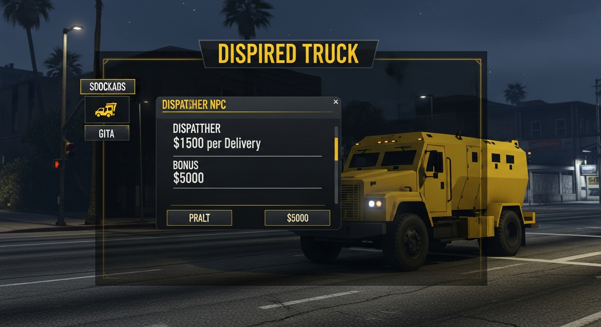

# 🚛 Carro Forte — Script FiveM para vRPEx

Script completo de transporte de valores para servidores FiveM com framework **vRPEx**.



---

## 📋 Como funciona

1. O jogador vai até o **local marcado no mapa** (blip amarelo 🟡)
2. Ao chegar perto, aparece na tela: **"Pressione E para falar com o Despachante"**
3. Ao pressionar **E**, abre o menu do despachante com detalhes da missão
4. O jogador aceita e clica em **"Pegar o Carro Forte"**
5. O caminhão blindado spawna na garagem
6. O jogador segue os **blips azuis** nos bancos e pressiona **E** para coletar
7. Após coletar todos os bancos, segue o **blip amarelo** da Reserva Federal
8. Pressiona **E** para entregar e recebe o pagamento 💰

---

## 📁 Estrutura de Arquivos

```
carro-forte/
├── fxmanifest.lua       ← manifest do recurso
├── config.lua           ← TODAS as configurações ficam aqui
├── client/
│   ├── main.lua         ← lógica principal do cliente
│   └── ui.lua           ← controle da interface NUI
├── server/
│   └── main.lua         ← lógica do servidor e pagamentos
└── html/
    ├── index.html        ← interface NUI
    ├── style.css         ← estilos da interface
    └── script.js         ← script da interface
```

---

## ⚙️ Instalação

**1.** Copie a pasta `carro-forte` para `resources/` do seu servidor:

```
resources/
└── carro-forte/   ← pasta aqui
```

**2.** Adicione no `server.cfg`:

```cfg
ensure carro-forte
```

**3.** Reinicie o servidor ou execute no console:

```
refresh
start carro-forte
```

---

## 🗺️ Configurar o local de início

No `config.lua`, edite a seção `Config.JobLocation` com as coordenadas do seu servidor:

```lua
Config.JobLocation = {
    x       = 225.4,    -- coordenada X  ← mude aqui
    y       = -808.3,   -- coordenada Y  ← mude aqui
    z       = 30.7,     -- coordenada Z  ← mude aqui
    heading = 270.0,    -- direção do NPC

    blipLabel        = "Carro Forte",
    blipSprite       = 67,
    blipColor        = 5,
    blipScale        = 0.9,

    interactText     = "Pressione ~g~E~w~ para falar com o Despachante",
    interactDistance = 3.5,
}
```

> 💡 Use `/coords` no seu servidor para descobrir coordenadas.

---

## 💰 Configurar pagamentos

```lua
Config.MoneyType      = "money"   -- "money" = limpo | "dirty_money" = sujo
Config.PayPerDelivery = 1500      -- valor por banco coletado
Config.BonusComplete  = 5000      -- bônus ao completar toda a missão
```

---

## 🏦 Adicionar ou remover bancos

Edite a lista `Config.PickupLocations` no `config.lua`:

```lua
Config.PickupLocations = {
    {
        label = "Banco Fleeca — Centro",
        x = 149.6,  y = -1042.9, z = 29.4,
    },
    {
        label = "Meu Banco Personalizado",  -- ← adicione quantos quiser
        x = 100.0,  y = -500.0,  z = 30.0,
    },
}
```

---

## ⚡ Velocidade e penalidades

```lua
Config.SpeedLimit      = 80    -- km/h máximo permitido
Config.SpeedPenalty    = 0.20  -- 20% de desconto por violação
Config.MaxSpeedPenalty = 0.80  -- desconto máximo de 80%
```

---

## 🚨 Assaltos NPC

```lua
Config.RobberyChance   = 0.30             -- 30% de chance por banco
Config.RobberyPedCount = 3                -- quantidade de NPCs
Config.RobberyPedModel = "g_m_y_lost_01"  -- modelo do NPC
Config.RobberyWeapon   = "weapon_pistol"  -- arma dos NPCs
```

---

## 🔑 Exigir emprego (opcional)

Para restringir apenas a jogadores com o cargo configurado no vRPEx:

```lua
Config.RequireJob = true        -- false = qualquer jogador pode usar
Config.JobName    = "carro_forte"
```

---

## 🖥️ Interface NUI

| Tela | O que aparece |
|------|--------------|
| **Despachante** | Menu de aceitar/recusar com valor por entrega, bônus e quantidade de bancos |
| **Carro Forte** | Checklist animado + botão para spawnar o veículo |
| **HUD** | Progresso dos bancos, ganhos, bônus e penalidade em tempo real |
| **Notificações** | Alertas no canto da tela para coleta, entrega, assalto e pagamento |

---

## 🛠️ Comando Admin

```
/resetcarroforte [id]
```

Reseta a missão de um jogador específico. Apenas admins.

---

## 📦 Dependências

- **vRPEx** — framework principal
- Exports `vrp` e `vrp_client` disponíveis no servidor

---

## ⚙️ Tabela completa de configurações

| Opção | Padrão | Descrição |
|-------|--------|-----------|
| `Config.JobName` | `"carro_forte"` | Nome do grupo no vRPEx |
| `Config.RequireJob` | `false` | Exigir cargo para usar |
| `Config.Vehicle` | `"stockade"` | Modelo do veículo |
| `Config.VehiclePlate` | `"CFORTE"` | Placa do veículo |
| `Config.MoneyType` | `"money"` | Tipo de dinheiro |
| `Config.PayPerDelivery` | `1500` | Valor por banco coletado |
| `Config.BonusComplete` | `5000` | Bônus de missão completa |
| `Config.MinDeliveries` | `3` | Mínimo de bancos por missão |
| `Config.MaxDeliveries` | `6` | Máximo de bancos por missão |
| `Config.SpeedLimit` | `80` | Limite de velocidade (km/h) |
| `Config.SpeedPenalty` | `0.20` | Desconto por violação |
| `Config.RobberyChance` | `0.30` | Chance de assalto NPC |
| `Config.RobberyPedCount` | `3` | Quantidade de assaltantes |
